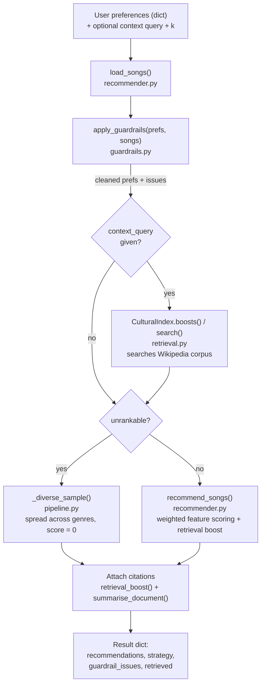

# 🎵 Music Recommender Simulation

## Project Summary

In this project you will build and explain a small music recommender system.

Your goal is to:

- Represent songs and a user "taste profile" as data
- Design a scoring rule that turns that data into recommendations
- Evaluate what your system gets right and wrong
- Reflect on how this mirrors real world AI recommenders

### The Original Project

**Represent songs and a user "taste profile" as data:** 
The initial project had a database of 20 songs. It had 7 features of a song it can use to score a song based on a user's database. Each feature has a value, and genre was the dominant feature, so it had the highest value. From a user's database, we know which songs the user likes and what features make it favorable, so we match that with a new database and choose the one that is closest, has a higher score, and resembles the profile across all features.

**Evaluate what your system gets right and wrong:** The recommendations work for ideally perfect inputs. However, edge cases such as "metal and low energy" contradict each other, so a song that hasn't been scored properly will get returned. Also, other edge cases, such as when specific numbers of energy or "danceability" are part of the input, values out of range get accepted and skew the score. It is also case sensitive, so "lofi" isn't treated the same as "Lofi." And it accepts edge cases such as empty input.

**Reflect on how this mirrors real world AI recommenders:** To some extent, this kind of scoring exists, I believe, but it should be aided with RAG to be more flexible and accurate.

### My Extension

**Represent songs and a user "taste profile" as data:** 
I wanted this recommender to be culturally aware, not just recommend songs that are already popular, but help people discover music from different parts of the world and understand the cultural diversity behind it.

As someone who considers myself a global citizen, I listen to music from many different cultures, including Cambodian, Thai, Bengali, Ethiopian, and South African music, as well as jazz from different countries. I found that a conventional recommender, which primarily relies on popularity, did not reflect the way I discover and enjoy music.

This recommender is designed for people who see music as a way to explore different cultures while still wanting recommendations that match their personal tastes. Genre, energy, and other song characteristics remain central to the recommendation process, we simply add **cultural diversity** as another dimension.


**Design a scoring rule that turns that data into recommendations:** 
Because manually managing a large music database is difficult, we decided to use a large song dataset from Kaggle as the foundation for our recommender. However, the dataset itself contained cultural biases and inaccuracies. For example, some African music was broadly categorized as “Afrobeat,” while African artists were sometimes not classified under African music at all. Other songs were assigned genres that did not accurately represent their cultural or musical context.

To address these issues, we created our own reference list of cultural and genre classifications that we believe are commonly overlooked or misrepresented. Whenever the recommender generates a result, it checks the recommendation against this list. This additional layer helps reduce inaccurate classifications and avoid reinforcing existing biases in the dataset, allowing the recommender to represent different cultures more thoughtfully.

On top of the recommendation system, we also changed the way users can interact with the recommender. Instead of limiting queries to song characteristics such as “sad song” or “gym song,” users can ask for culturally or conceptually specific music, such as “Ethiopian jazz,” “music about activism,” or “feminist songs.” The recommender then interprets the description and looks for songs that best match the user’s request.

This is where we incorporated **Retrieval-Augmented Generation (RAG)**. We use Wikipedia as a source for information about genres, cultural contexts, and broader concepts from around the world. The retrieved descriptions are then compared with the user’s query using vector-based similarity scoring. This allows the recommender to connect a user’s words with relevant musical and cultural descriptions, rather than relying only on predefined song features.

While designing the recommendation system, we also considered phrases that could create misleading similarities. For example, terms such as “French genre” and simply “genre” may appear similar in a vector-based comparison even though they provide very different levels of information. To reduce these false matches, we created a list of common or overly generic phrases that should not contribute to similarity scoring.

We also added safeguards around Wikipedia retrieval. Artist pages often contain biographical information that is not useful for defining genres or cultural concepts, and names may be introduced in generic phrases such as “X is a person.” To prevent these pages from influencing recommendations, we filter out personal artist pages and other irrelevant sources before using the retrieved information.

Overall, we incorporated RAG retrieval directly into the recommendation scoring mechanism. This improves the accuracy of recommendations while making the system flexible enough to handle a wider range of queries, including cultural and conceptual descriptions.

The new model also gives users greater control over their recommendations by allowing them to choose which musical features they want to prioritize. This means the recommender can balance cultural relevance with personal preferences, rather than treating every feature as equally important.

**Evaluate what your system gets right and wrong:** 
The recommender also includes **guardrails** to handle edge cases that the original model could not handle reliably. For example, if a user submits an empty query, the system does not pretend to have calculated a personalized recommendation. Instead, it provides a diverse selection of songs for the user to explore and clearly indicates that the results are not based on a calculated preference match.

The same approach is used when a user provides a genre that the system cannot identify or verify. Rather than generating a potentially misleading recommendation, the guardrails trigger a diverse set of songs for exploration and disclose that the system could not produce a calculated recommendation for the given genre.

*A few more things worth naming plainly, in case they're useful:*

*What it gets right:* the system never makes up a cultural claim. Every quote and link it shows came from a real Wikipedia page, so it can always be double-checked instead of just trusted. And when the input has a problem — a typo, a genre that doesn't exist, a blank profile — it says what it changed instead of quietly guessing or failing silently.

*What it gets wrong:* the system only understands the *words* on a Wikipedia page, not the actual music. If an artist's page never happens to use the word someone searched for, the system treats it as if there's nothing there, even if that artist is genuinely the best answer. And because some cultures have much longer, more detailed Wikipedia coverage than others, the system ends up sounding most confident about the music that was already well documented online — and thinnest about exactly the music it was built to help people discover. It also has no memory between requests: it doesn't learn from what someone liked or skipped last time, so every search starts from zero.


**Reflect on how this mirrors real world AI recommenders:** I had always wondered why recommendations on platforms like YouTube can feel so accurate, and building this project helped me understand why. Real-world recommendation systems often combine multiple approaches, including vector-based similarity and manually defined scoring mechanisms, rather than relying on a single method.

I also learned how RAG can make recommendations more reliable by grounding the system in external sources. Instead of relying entirely on an AI model's generated knowledge, the recommender can reference retrieved information when making decisions. This reduces the risk of hallucinations and helps prevent the system from recommending genres, cultural concepts, or other information that does not actually exist.

### What Each File Does

* **`build_catalog.py`**: Generates the song catalog from a Spotify dataset. It handles data cleaning and filters out invalid or unnecessary columns.

* **`build_corpus.py`**: Builds a dictionary of descriptions for global genres, cultural features, and other concepts that the recommender can reference during retrieval.

* **`pipeline.py`**: Connects the different parts of the system by combining manual scoring with retrieval. This is the core of the project and ties the recommendation process together.

* **`guardrails.py`**: Handles edge cases and prevents the system from producing unreliable or misleading recommendations.

* **`retrieval.py`**: Performs vector-based similarity scoring to find descriptions that are relevant to the user's query.

* **`recommender.py`**: Generates the final recommendation list, including human-readable scores and explanations for why each song was recommended.


---

## How The System Works

### Architecture

Source: [`diagrams/architecture.mmd`](diagrams/architecture.mmd)



Each `Song` carries seven features the scorer can use: `genre`, `mood`, `energy`, `valence`, `danceability`, `acousticness`, and `artist`. A `UserProfile` stores what the listener wants on those same dimensions — `favorite_genre`, `favorite_mood`, `target_energy`, `likes_acoustic`, and optionally `favorite_artist`, `target_valence`, and `target_danceability`.

Scoring works by comparing a profile against a song feature by feature and adding up how well each one matches, weighted by how much that feature should count:

| Feature | Weight |
|---|---|
| Genre | 3.0 |
| Mood | 2.0 |
| Energy | 2.0 |
| Valence | 1.5 |
| Danceability | 1.5 |
| Acousticness | 1.0 |
| Artist | 1.0 (bonus) |

Genre, mood, and artist are exact matches — either a song's genre matches the profile's favorite genre or it doesn't. Energy, valence, and danceability are proximity matches — the closer the song's value is to what the listener asked for, the more points it earns. If a context query is given, a cultural-relevance boost from retrieval gets added on top of all of that (see the walkthrough below). Songs are then just sorted by total score, highest first, and the top few are returned.

### A Walkthrough Example

Say someone asks for energetic music (`energy: 0.5`) with nothing else. The system just compares that one number against every song's energy value and hands back whichever songs sit closest to it — in a real run this returns a Brazilian track, a reggaeton track, and a reggae track, purely because their energy values happen to be close to 0.5. Nothing about the request was cultural, so nothing culturally specific comes back.

Now say that same person adds a text request: `"ethiopian jazz"`. The system reads through short Wikipedia articles about music genres and artists, looking for which ones use language closest to that phrase. In a real run, the strongest match is the article on Ethio-jazz, followed by the article on the artist Mulatu Astatke. Because both of those matches point at real values in the catalog — the genre `ethio-jazz` and the artist `Mulatu Astatke` — songs with those values get a score boost on top of their normal energy-based score. The top result becomes a real Mulatu Astatke track, and the explanation quotes the exact sentence from Wikipedia that justified the boost, with a link, so it can be checked rather than just trusted.


## Experiments You Tried

*(Still to fill in: what happened when you changed a feature weight, added a new feature to scoring, or tried the system with different kinds of user profiles.)*

---

## Limitations and Risks

The full breakdown, with specific failure examples, is in `model_card.md`. The short version:

- The system can't tell a real cultural claim from a coincidence of wording — it matches on shared vocabulary, not actual meaning.
- Its cultural notes are only as good as Wikipedia's coverage, and that coverage is uneven — richer for well-documented, mostly Western artists, thinner for the very music this project set out to surface.
- It only works on the songs in the catalog, and only understands the features it's given (genre, mood, energy, valence, danceability, acousticness) — nothing about lyrics, language, or a song's actual meaning.
- It has no memory between requests — it doesn't learn from what a listener liked or skipped last time.

---
## Guardrail Examples: Before and After

I ran the same six weird/broken inputs through the system twice — once before I built the guardrails, once after — so you can see exactly what changed.

Here's what each one is testing, in plain words:

- **conflicting: metal + low energy** — a genre/mood combo that doesn't really exist in the catalog. This one wasn't broken before, it's just a normal "nothing matches well" case.
- **out-of-range energy** — I asked for `energy: 5.0`, but energy is only supposed to go from 0 to 1. Before the fix, this made every single score negative and made no sense. Now it just gets capped back down to 1.0 automatically, so the scores stay sane.
- **typo + wrong case** — I typed `"Pop"` with a capital letter and `"saad"` instead of a real mood. Before, both of these silently matched nothing and every song scored a flat `0.00`, but it still looked like a real ranked list. Now the system tells you it couldn't recognize either value, and since nothing usable was left, it honestly says "here's a random spread of songs" instead of pretending to rank them.
- **empty profile** — I gave it literally no preferences at all. Before, it just handed back the first 5 rows of the file like they were personalized picks. Now it says flat out "you didn't give me anything to go on" and gives a spread of different genres instead.
- **numeric-only mid values** — normal, valid numbers, no bugs to trigger here. Included as a "does it still work normally" sanity check.
- **lofi but not acoustic** — `"lofi"` isn't a genre in this catalog. Before, it just silently failed to match anything. Now it explicitly says the genre wasn't recognized.

*Note: the "before" block below is also the last place this README uses the original starter catalog — song titles like "Sunrise City" and "Gym Hero" are that early placeholder data. Everything from the "after" block onward uses the real catalog.*

### Before guardrails
  ```
  === conflicting: metal + low energy: {'genre': 'metal', 'mood': 'aggressive', 'energy': 0.1} ===
Iron Verdict - Score: 5.26  (matches genre (metal); matches mood (aggressive))
Spacewalk Thoughts - Score: 1.64  (energy is a close match)
Moonlit Sonata Redux - Score: 1.60  (general match)
Library Rain - Score: 1.50  (general match)
Coffee Shop Stories - Score: 1.46  (general match)

=== out-of-range energy: {'genre': 'pop', 'energy': 5.0} ===
Gym Hero - Score: -3.14  (matches genre (pop))
Sunrise City - Score: -3.36  (matches genre (pop))
Iron Verdict - Score: -6.06  (general match)
Voltage Rush - Score: -6.10  (general match)
Storm Runner - Score: -6.18  (general match)

=== typo + wrong case: {'genre': 'Pop', 'mood': 'saad'} ===
Sunrise City - Score: 0.00  (general match)
Midnight Coding - Score: 0.00  (general match)
Storm Runner - Score: 0.00  (general match)
Library Rain - Score: 0.00  (general match)
Gym Hero - Score: 0.00  (general match)

=== empty profile: {} ===
Sunrise City - Score: 0.00  (general match)
Midnight Coding - Score: 0.00  (general match)
Storm Runner - Score: 0.00  (general match)
Library Rain - Score: 0.00  (general match)
Gym Hero - Score: 0.00  (general match)

=== numeric-only mid values: {'energy': 0.5, 'valence': 0.5, 'danceability': 0.5} ===
Midnight Coding - Score: 4.57  (energy is a close match; mood/positivity is a close match; danceability is a close match)
Fields of Amber - Score: 4.56  (energy is a close match; mood/positivity is a close match; danceability is a close match)
Focus Flow - Score: 4.52  (energy is a close match; mood/positivity is a close match; danceability is a close match)
Library Rain - Score: 4.43  (energy is a close match; mood/positivity is a close match; danceability is a close match)
Dust and Diesel - Score: 4.38  (energy is a close match; mood/positivity is a close match; danceability is a close match)

=== lofi but not acoustic: {'genre': 'lofi', 'likes_acoustic': False} ===
Midnight Coding - Score: 3.29  (matches genre (lofi))
Focus Flow - Score: 3.22  (matches genre (lofi))
Library Rain - Score: 3.14  (matches genre (lofi))
Voltage Rush - Score: 0.97  (general match)
Iron Verdict - Score: 0.96  (general match)
```

### After guardrails
```
=== conflicting: metal + low energy: {'genre': 'metal', 'mood': 'aggressive', 'energy': 0.1} ===
context query: (none — retrieval disabled)
guardrails:
    genre 'metal' was not recognised and could not be matched to a known value; ignored.
    mood 'aggressive' was not recognised and could not be matched to a known value; ignored.

recommendations:
  1. Baarishein — Anuv Jain
     indian · India · melancholic · score 1.96
  2. Scent of a Woman: Tango (Por Una Cabeza) — Carlos Gardel
     tango · Argentina · melancholic · score 1.94
  3. Kol Düğmeleri — Barış Manço
     anatolian rock · Turkey · melancholic · score 1.82
  4. 風雨不改 (電影《阿媽有咗第二個》主題曲) — Keung To
     cantopop · Hong Kong · melancholic · score 1.80
  5. 刻在我心底的名字 (Your Name Engraved Herein) - 電影<刻在你心底的名字>主題曲 — Crowd Lu
     mandopop · Taiwan · melancholic · score 1.80

=== out-of-range energy: {'genre': 'pop', 'energy': 5.0} ===
context query: (none — retrieval disabled)
guardrails:
    energy of 5.0 is outside 0.0-1.0; clamped to 1.0.
    genre 'pop' was not recognised and could not be matched to a known value; ignored.

recommendations:
  1. 新時代 - ウタ from ONE PIECE FILM RED — Ado
     j-pop · Japan · intense · score 1.98
  2. 祝福 — YOASOBI
     j-pop · Japan · celebratory · score 1.92
  3. Zombie — Fela Kuti
     afrobeat · Nigeria · celebratory · score 1.88
  4. Water No Get Enemy — Fela Kuti
     afrobeat · Nigeria · celebratory · score 1.86
  5. Mas Que Nada — Sérgio Mendes
     samba · Brazil · celebratory · score 1.86

=== typo + wrong case: {'genre': 'Pop', 'mood': 'saad'} ===
context query: (none — retrieval disabled)
guardrails:
    genre 'Pop' was not recognised and could not be matched to a known value; ignored.
    mood 'saad' was not recognised and could not be matched to a known value; ignored.
    No usable preferences were given; returning a diverse sample instead of a ranking.

no usable preferences — diverse sample, not a ranking:
  1. Water No Get Enemy — Fela Kuti
     afrobeat · Nigeria · celebratory · score 0.00
  2. For My Hand (feat. Ed Sheeran) — Burna Boy
     afrobeats · Nigeria · warm · score 0.00
  3. Ömrümün Sonbaharında — Barış Manço
     anatolian rock · Turkey · melancholic · score 0.00
  4. 風雨不改 (電影《阿媽有咗第二個》主題曲) — Keung To
     cantopop · Hong Kong · melancholic · score 0.00
  5. Bam Bam — Sister Nancy
     dancehall · Jamaica · celebratory · score 0.00

=== empty profile: {} ===
context query: (none — retrieval disabled)
guardrails:
    No usable preferences were given; returning a diverse sample instead of a ranking.

no usable preferences — diverse sample, not a ranking:
  1. Water No Get Enemy — Fela Kuti
     afrobeat · Nigeria · celebratory · score 0.00
  2. For My Hand (feat. Ed Sheeran) — Burna Boy
     afrobeats · Nigeria · warm · score 0.00
  3. Ömrümün Sonbaharında — Barış Manço
     anatolian rock · Turkey · melancholic · score 0.00
  4. 風雨不改 (電影《阿媽有咗第二個》主題曲) — Keung To
     cantopop · Hong Kong · melancholic · score 0.00
  5. Bam Bam — Sister Nancy
     dancehall · Jamaica · celebratory · score 0.00

=== numeric-only mid values: {'energy': 0.5, 'valence': 0.5, 'danceability': 0.5} ===
context query: (none — retrieval disabled)

recommendations:
  1. 你,好不好? - TVBS連續劇【遺憾拼圖】片尾曲 — Eric Chou
     mandopop · Taiwan · warm · score 4.81
  2. Deslizes — Fagner
     mpb · Brazil · melancholic · score 4.71
  3. 如果可以 - 電影"月老"主題曲 — WeiBird
     mandopop · Taiwan · melancholic · score 4.66
  4. Sodade — Cesária Evora
     morna · Cape Verde · melancholic · score 4.65
  5. Kesariya (From "Brahmastra") — Pritam
     indian · India · melancholic · score 4.65

=== lofi but not acoustic: {'genre': 'lofi', 'likes_acoustic': False} ===
context query: (none — retrieval disabled)
guardrails:
    genre 'lofi' was not recognised and could not be matched to a known value; ignored.

recommendations:
  1. Drive - Edit — Black Coffee
     south african house · South Africa · intense · score 1.00
  2. Turn Me On — Black Coffee
     south african house · South Africa · celebratory · score 1.00
  3. Give It To Me - Full Vocal Mix — Matt Sassari
     french · France · celebratory · score 1.00
  4. 夜に駆ける — YOASOBI
     j-pop · Japan · celebratory · score 1.00
  5. Shut Down — BLACKPINK
     k-pop · South Korea · celebratory · score 1.00
```

## Reflection

Read and complete `model_card.md`:

[**Model Card**](model_card.md)

What I learned about how recommenders turn data into predictions:

- A recommendation isn't a judgment,  it's arithmetic. Every feature (genre, mood, energy, valence, danceability, acousticness, artist) gets a weight, each song's score is just those weighted differences added up, and "best match" simply means highest number.
- Adding RAG didn't change that logic, it added a new input to it. A Wikipedia article gets turned into a similarity score, and that score gets folded into the same weighted sum as everything else, it's still arithmetic underneath, just arithmetic that can now respond to something the song's own columns never recorded, like a cultural tradition.
- Grounding the retrieval in real Wikipedia text (instead of letting a model just generate a cultural claim) meant the system can't hallucinate a fact,  every claim traces back to a real quote and a real link. But it also means the system is only as good as what's already written about a topic, which turned out to be its own kind of limit.

Where bias or unfairness could show up in a system like this:

- In the training data before any code runs at all, the raw Kaggle dataset itself lumped many different African genres under one label ("Afrobeat") and sometimes didn't classify African artists as African music, so a naive recommender would have inherited that bias silently.
- In how "confident" the system sounds, its cultural explanations are most detailed and convincing for artists with long, well-documented Wikipedia pages, which skews toward already-popular, mostly Western and anglophone music. That means the system sounds least sure about exactly the underrepresented music it was built to help people discover — the opposite of what it's supposed to do.
- In treating word overlap as if it were understanding — the retrieval score only measures how much vocabulary a query shares with an article, not whether the article is actually the right cultural answer. A real, correct match can score zero just because the wording doesn't overlap, and an irrelevant page can score high just because it happens to share words.
- In silent failures, before guardrails existed, out-of-range numbers, typos, and empty profiles all used to produce results that looked legitimate but weren't, which is its own kind of unfairness: a user has no way to know their input was mishandled unless the system tells them.


